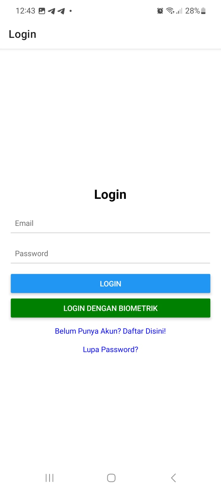
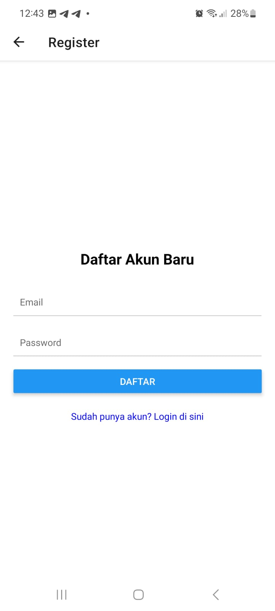
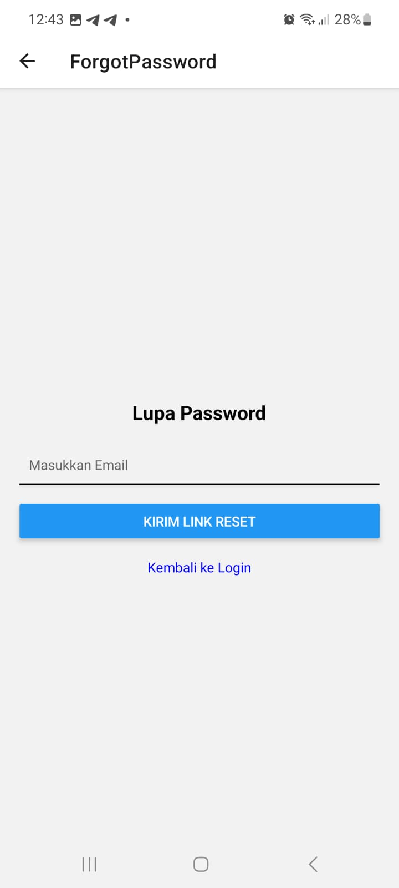
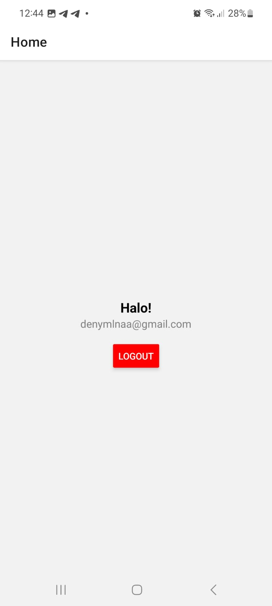

## Dokumentasi Tugas Mandiri Pertemuan 9 Mobile Lanjut

Nama    : Andika Deny Maulana

NIM     : 2410501015

Kelas   : B

## Library Utama yang Digunakan
- Firebase SDK (firebase/auth): Sebagai backend utama untuk sistem autentikasi, manajemen akun, dan pengiriman email reset password.
- Expo Local Authentication: Digunakan untuk mengakses hardware biometrik pada perangkat guna melakukan verifikasi sidik jari atau wajah.
- Expo Secure Store: Untuk menyimpan kredensial pengguna (email & password) secara terenkripsi di dalam penyimpanan aman perangkat, sehingga    fitur biometrik dapat bekerja secara aman.
- React Navigation: Digunakan untuk mengelola perpindahan antar layar (Stack Navigator) setelah proses autentikasi berhasil atau gagal.

## Fitur Tugas Mandiri yang Dipilih
Fitur no 3, yaitu Auto-logout setelah 5 menit idle (gunakan AppState + setTimeout). 

## Fitur Lainnya
- Login Biometrik
- Proteksi Verifikasi Email

## Screenshots

| Login Screen | Register Screen |
| :---: | :---: |
|  |  |

| Forgot Password | Home Screen |
| :---: | :---: |
|  |  |

## Link Video Demo
https://drive.google.com/drive/folders/1PwascYMQWVKpSAsynEGxAd-XKLRESLS3